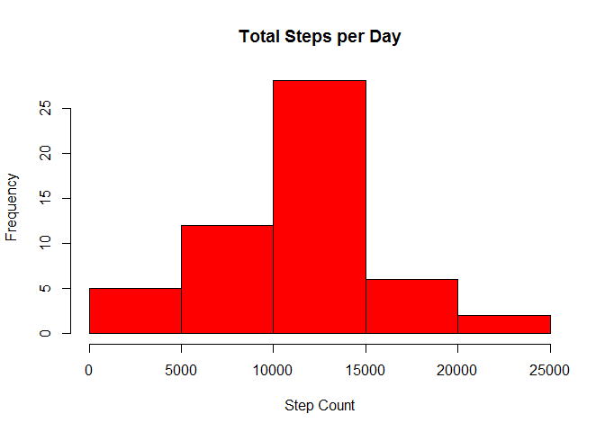
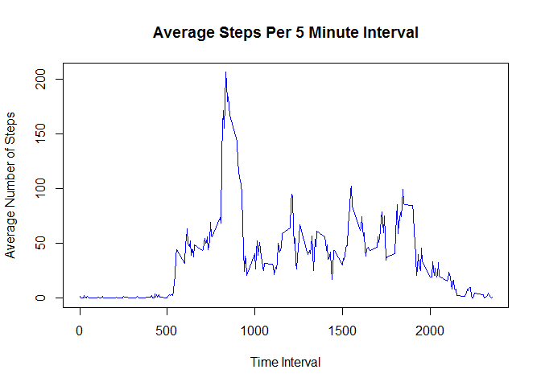
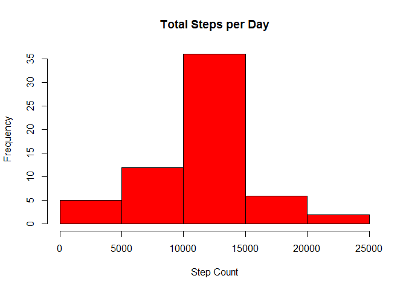
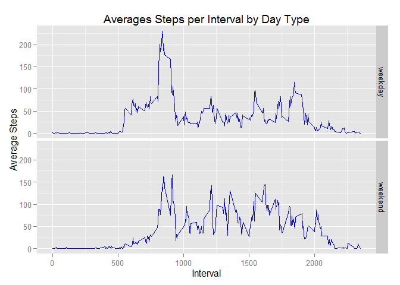

### Peer Assessment 1 for Reproducible Research


#### Load and Preprocess the Data

```r
activityData <- read.csv("./activity.csv")
activityData$date <- as.Date(activityData$date, "%m/%d/%Y")
```


#### What is mean total number of steps taken per day?

* Calculate the total number of steps taken per day

```r
library(plyr) 
steps <- ddply(activityData, c("date"), summarise, total = sum(steps))
```

* Make a histogram of the total number of steps taken each day

```r
hist(steps$total, main="Total Steps per Day", xlab="Step Count", col="red")
```

 


* Calculate and report the mean and median of the total number of steps taken per day

```r
meansteps <- mean(steps$total, na.rm="TRUE")
meansteps
```

```
## [1] 10766.19
```
**The mean total number of steps per day is 1.0766189\times 10^{4}.**  


```r
medsteps <- median(steps$total, na.rm="TRUE")
medsteps
```

```
## [1] 10765
```
**The median total number of steps per day is 10765.**  

#### What is the average daily activity pattern?

* Make a time series plot of the 5-minute interval and the average number of steps taken, averaged across all days

```r
stepsPerInterval <- ddply(activityData, c("interval"), summarise, aveSteps = mean(steps,na.rm="TRUE"))
```


```r
plot(stepsPerInterval$interval, stepsPerInterval$aveSteps,  type="l", col="blue",
     main="Average Steps Per 5 Minute Interval", 
     ylab="Average Number of Steps", xlab="Time Interval")  
```

 

* Which 5-minute interval, on average across all the days in the dataset, contains the maximum number of steps?

```r
intervalMax <- subset(stepsPerInterval, aveSteps == max(stepsPerInterval$aveSteps), select=c(interval))
intervalMax
```

```
##     interval
## 104      835
```
**The 5 minute interval with the maximum number of steps is 835.**  


#### Imputing missing values

* Calculate and report the total number of missing values in the dataset. 
* Devise a strategy for filling in all of the missing values in the dataset. 
* Create a new dataset that is equal to the original dataset but with the missing data filled in.

```r
missingValueCount <- length(which(is.na(activityData$steps)))
missingValueCount
```

```
## [1] 2304
```
**The total number of missing values is 2304.** 


**Missing values are replaced with the mean of the missing value's corresponding the 5-minute interval.** 

```r
newDataSet <- merge(activityData,stepsPerInterval,by.x="interval",by.y="interval",all=FALSE)

newDataSet$modSteps <- ifelse(is.na(newDataSet$steps), newDataSet$aveSteps, newDataSet$steps)
```


* Make a histogram of the total number of steps taken each day

```r
stepsReplaceMiss <- ddply(newDataSet, c("date"), summarise, total = sum(modSteps))

hist(stepsReplaceMiss$total, main="Total Steps per Day", xlab="Step Count", col="red")
```

 

* Calculate and report the mean and median total number of steps taken per day. 
* Do these values differ from the estimates from the first part of the assignment? 
* What is the impact of imputing missing data on the estimates of the total daily number of steps?

```r
meansteps2 <- mean(stepsReplaceMiss$total, na.rm="TRUE")
meansteps2
```

```
## [1] 10766.19
```
**The mean total number of steps per day is 1.0766189\times 10^{4}.**  

```r
medsteps2 <- median(stepsReplaceMiss$total, na.rm="TRUE")
medsteps2
```

```
## [1] 10766.19
```
**The median total number of steps per day is 1.0766189\times 10^{4}.**  
**The impact of replacing missing values is very small.**  
**The median differs when replacing missing values. It changes from 10765 to 10766.19**  


#### Are there differences in activity patterns between weekdays and weekends?

* Create a new factor variable in the dataset with two levels - "weekday" and "weekend" indicating whether a given date is a weekday or weekend day.

```r
newDataSet$day <- weekdays(newDataSet$date)
newDataSet$dayType <- ifelse(newDataSet$day =="Saturday" | newDataSet$day =="Sunday", "weekend", "weekday")
newDataSet$dayType <- as.factor(newDataSet$dayType)

aveStepsPerInterval <- ddply(newDataSet, c("interval","dayType"), summarise, aveSteps = mean(modSteps))
```

* Make a panel plot containing a time series plot of the 5-minute interval and the average number of steps taken, averaged across all weekday days or weekend days

```r
library(ggplot2)

qplot(interval,aveSteps,data=aveStepsPerInterval, facets=dayType~., geom=c("line"), color=I("blue"), xlab="Interval", ylab="Average Steps",
      main="Averages Steps per Interval by Day Type")
```

 
